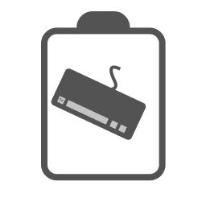

</img>

<h1 align="center">Lookahead</h1>

The fast, beautiful to-do and notes app for everyone.

<!-- 

    </img>

 -->

# Usage

## Web

To see the latest version, visit
https://lookahead.web.app (not deployed yet) 
To see the latest development build, visit
https://lookahead-dev.web.app

## CLI

You can visit the recent Github Actions build to download the latest (unstable!) CLI build or build it yourself.

> **Note:** The build hosted at lookahead-dev.web.app is the previous Next.js build
> which will be replaced soon with the new Web Components build.

# Current status

Real work has just started! Its only a matter of time for this idea to become a reality.

# Documentation

There is no real documentation for anything since work is still going on on everything.

# Contributing

A file called CONTRIBUTING.md will be pushed soon which will contain all the little things you might need to start contributing. For now, just fork the repo, do what you'd like to, and if its useful, come and submit a PR!
