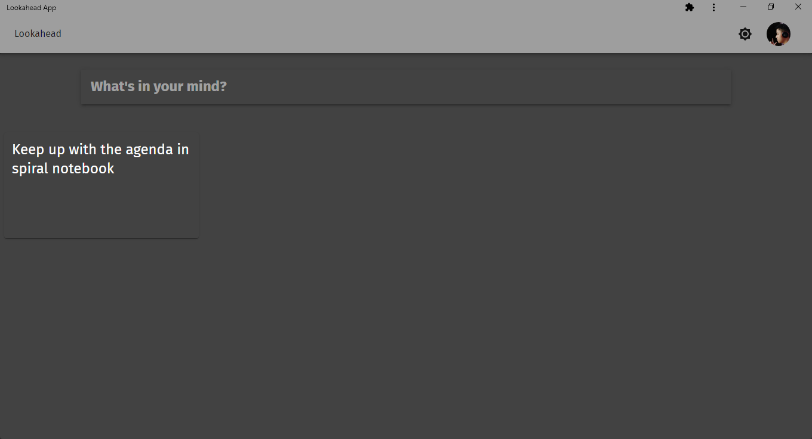

<h1 align="center">Lookahead</h1>

The fast, beautiful to-do and notes app for everyone.

    

<!-- 

    </img>

 -->

# Usage

## Web

Details will be added soon

## CLI

Details will be added soon

# Current status

Real work has just started! Its only a matter of time for this idea to become a reality.

# Documentation

There is no real documentation for anything since work is still going on on everything.

# Contributing

A file called CONTRIBUTING.md will be pushed soon which will contain all the little things you might need to start contributing. For now, just fork the repo, do what you'd like to, and if its useful, come and submit a PR!
